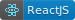
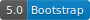

# Panyart

</img>
</img>

This project is a landing page for a digital artist.

It contains several sections about the artist's work and the website is currently runnning at https://panyart.studio.

---

## How to Run Locally:

This project was bootstrapped with [Create React App](https://github.com/facebook/create-react-app).

1. Having `npm` properly installed on your machine, after um cloned this repository you can run:

    ```
    npm install
    ```

    In order to install all dependencies.

2. And then, you can simply run:

    ```
    npm start
    ```

    In order to run the app locally at http://localhost:3000.

There are some others scripts you can execute.
Read them at `package.json` file. 
